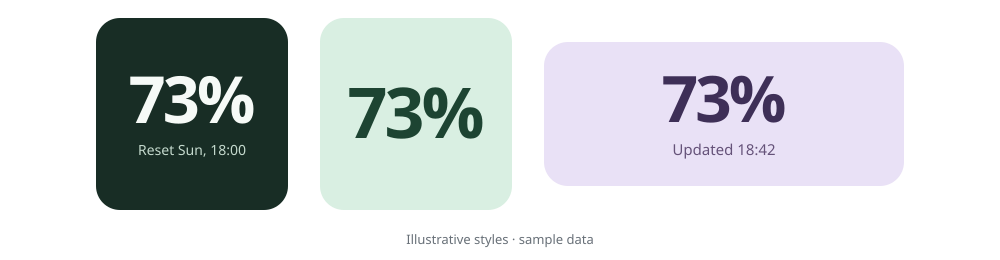

# WeeklyMeter

### Your weekly Codex quota, at a glance.

A small, customizable **Android home-screen and floating widget** for your remaining Codex weekly usage. Runs on your phone — no PC or relay server.

[](https://github.com/Husky-Bytes/WeeklyMeter/releases/latest)


**[Download APK](https://github.com/Husky-Bytes/WeeklyMeter/releases/latest)** · [What's new](CHANGELOG-0.6.6.md) · [Report an issue](https://github.com/Husky-Bytes/WeeklyMeter/issues) · [한국어](#한국어)



> Unofficial, experimental app. Shows the remaining percentage of a **selected 7-day Codex limit**, not a combined quota for all ChatGPT models. Not affiliated with or endorsed by OpenAI.

## Small widget. Your style.

- **1×1 and resizable** — show just `n%`, or add reset and last-update times. Minimum size depends on your launcher.
- **Floating mode** — keep usage above other apps. Tap to refresh, drag to move, hold to close. Separate styling and size controls.
- **Make it yours** — bundled fonts, per-row text size, color wheel, spacing, row order, background and overall opacity.
- **Only what you need** — choose individual date/time components, time-only rows, or no dates. The actual-size preview stays pinned while editing.
- **Tap or auto-refresh** — optional refresh feedback; custom automatic intervals from 15 minutes to 7 days. Successful updates feed both widgets.
- **English & Korean** — follows the primary system language (Korean → Korean; otherwise English), with a globe menu to switch.

## Get started

**Android 8.0+ · APK installation · Browser sign-in**

1. **Install** the APK from [Latest release](https://github.com/Husky-Bytes/WeeklyMeter/releases/latest). For updates, install over the existing app without uninstalling.
2. **Sign in** through the app's browser-login button. Enter your password only on the official OpenAI page, return to the app, and select your weekly limit.
3. **Add a widget** from your launcher's widget picker, then customize it in WeeklyMeter. Tap the widget to refresh.

For floating mode, choose **Show floating widget** and allow **Display over other apps**. After granting permission, you can also quickly triple-tap the same home widget to show it. This permission is not needed for home-screen widgets.

Automatic refresh is **best effort, not real time**: Android battery and network restrictions can delay it. Opening the app or changing appearance does not fetch usage. Enable the last-successful-update time to see how recent the value is.

## Before connecting your account

- The app makes authentication and usage requests only — **no chat/model-generation requests, ads, or analytics SDKs**. Live-account quota or billing effects have not been measured.
- Tokens are encrypted using Android Keystore and excluded from backups, but **their permissions are not limited to read-only usage access**. This is not a security guarantee.
- Unofficial authentication and an internal usage endpoint may stop working. Sessions may require signing in again; permanent login is not guaranteed.
- **Current-version real-account and physical-device behavior, including Galaxy S25 Ultra / One UI, is unverified.** Build and host-test results are not device validation.

Read the [security scope](SECURITY.md) before connecting. Usage shown on screen may appear in screenshots; never share tokens, authorization codes, callback URLs, or account files in issues.

<details>
<summary>For developers: build, verification, and notices</summary>

- [Recorded checks and limitations](TEST-RESULTS.txt) · [0.6.6 changes](CHANGELOG-0.6.6.md)
- [Windows build script](build-apk.ps1) · [Linux build script](build-apk.sh) · [Android runtime test harness](tests/android-runtime/README.md)
- Native Java + Android SDK; no Gradle. Package: `dev.yerin.weeklymeter`; minSdk 26, targetSdk 35.
- Windows build environment: JDK 21, Android platform 36, build-tools 35.0.0, Python 3. Use your own local paths and a fresh build directory:

```powershell
.\build-apk.ps1 -Project . -BuildDirectory ..\build-current -SigningDirectory ..\private-signing -Sdk D:\Android\Sdk -Jdk 'C:\Program Files\Android\Android Studio\jbr'
```

The APK is written to `dist/WeeklyMeter.apk` inside the build directory. A self-signed build cannot update the published APK unless it uses the same signing key. Keep signing keys and account data private. Linux builds and byte-for-byte reproducibility have not been verified.

ChatGPT and the OpenAI logo are OpenAI trademarks; the optional widget identifier does not imply endorsement. Bundled fonts use SIL Open Font License 1.1: [notices](app/src/main/assets/NOTICES.txt) · [font licenses](app/src/main/assets/fonts). No project-wide license has been assigned.

</details>

---

## 한국어

**Codex 주간 잔여량을 작게, 원하는 모습으로.**

PC나 외부 중계 서버 없이 폰에서 사용하는 Android 홈 화면·플로팅 위젯입니다. `n%`만 표시하거나 초기화·마지막 조회 시각을 함께 볼 수 있습니다.

**[최신 APK 다운로드](https://github.com/Husky-Bytes/WeeklyMeter/releases/latest)** · [변경 내용](CHANGELOG-0.6.6.md) · [문제 제보](https://github.com/Husky-Bytes/WeeklyMeter/issues)

- **1×1·크기 조절**: 실제 최소 크기는 런처에 따라 달라집니다.
- **독립적인 홈·플로팅 꾸미기**: 글꼴, 행별 크기·색·순서·위치, 여백, 전체·배경 투명도를 조절합니다. 미리보기는 상단에 고정됩니다.
- **날짜·시간 자유 선택**: 요소별 표시·숨김, 시간만 표시, 마지막 성공 조회 시각을 지원합니다.
- **탭 새로고침·자동 조회**: 자동 간격은 15분~7일이며 두 위젯에 함께 반영됩니다. 절전·네트워크 제한에 따라 지연될 수 있습니다.
- **플로팅 위젯**: 탭하면 새로고침, 끌면 이동, 길게 누르면 닫기. 표시 권한 허용 후 홈 위젯을 빠르게 세 번 눌러 열 수도 있습니다.

### 설치

1. Android 8.0 이상에서 최신 APK를 설치합니다. 업데이트할 때는 앱을 삭제하지 말고 덮어 설치하세요.
2. 앱에서 브라우저 로그인을 시작하고, 공식 OpenAI 화면에서 로그인한 뒤 주간 한도를 선택합니다.
3. 홈 화면에 **주간 잔여량(WeeklyMeter)** 위젯을 추가하고 앱에서 꾸밉니다. 플로팅은 **플로팅 위젯 띄우기**에서 시작합니다.

첫 번째 시스템 언어가 한국어면 한국어, 그 외에는 영어로 시작하며 지구본 메뉴에서 바꿀 수 있습니다. 앱 진입·꾸미기 변경만으로 사용량을 조회하지 않습니다.

### 계정 연결 전 확인

**OpenAI와 무관한 비공식 실험 앱**입니다. 선택한 **Codex 7일 한도의 잔여율**이며 ChatGPT 전체 모델의 통합 잔여량은 아닙니다. 앱은 인증·사용량 조회만 하고 채팅이나 모델 생성 요청을 보내지 않지만, 실계정 한도·과금 변화는 측정하지 않았습니다.

토큰은 암호화·백업 제외 저장하지만 **사용량 읽기 전용 권한으로 제한되지 않습니다**. 서비스 변경이나 세션 만료로 재로그인이 필요할 수 있습니다. 현재 버전의 실계정·S25 Ultra/One UI 실기기 동작은 미검증입니다. [보안 범위](SECURITY.md) · [검사 기록](TEST-RESULTS.txt)

문제 제보에는 기기·Android·앱 버전과 재현 순서를 적어 주세요. **비밀번호·토큰·인증 코드·콜백 주소·계정 파일은 올리지 마세요.** 스크린샷을 공유할 때도 개인정보를 가려 주세요.
