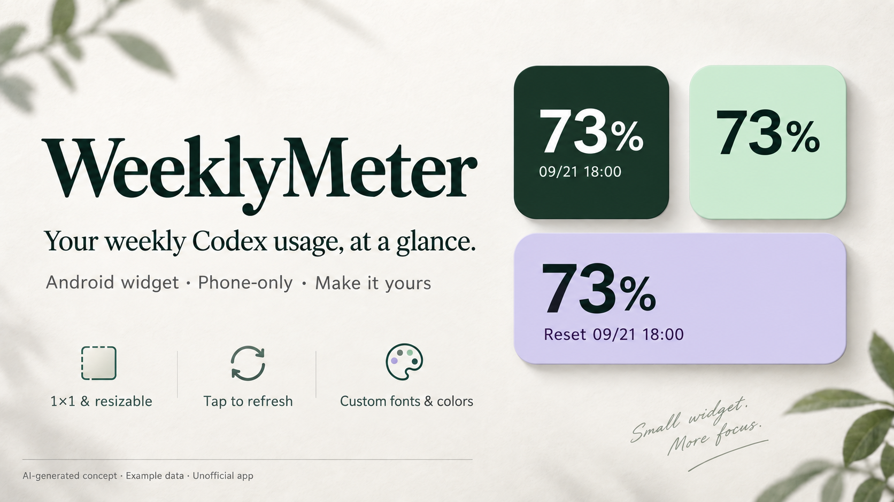

# WeeklyMeter

**Codex 주간 잔여량, 폰 홈 화면에서 한눈에.**

PC나 외부 중계 서버 없이 폰에서 동작하는 Android 위젯입니다. `n%`만 작게 두거나, 초기화 시각과 마지막 조회 시각을 함께 표시하고 내 홈 화면에 맞게 꾸밀 수 있습니다.

[한국어](README.md) · [English](README.en.md)

**[Android APK 다운로드 · 0.5.1](https://github.com/Husky-Bytes/WeeklyMeter/releases/download/v0.5.1/WeeklyMeter-0.5.1.apk)** · [변경 내용 / 릴리스](https://github.com/Husky-Bytes/WeeklyMeter/releases/tag/v0.5.1) · [문제 제보 / 제안](https://github.com/Husky-Bytes/WeeklyMeter/issues)



*AI로 만든 설명용 콘셉트 이미지입니다. 수치는 가상이며 실제 기기 스크린샷이나 실제 화면 배치 검증 결과가 아닙니다.*

*AI-generated illustrative concept with synthetic values; not a real-device screenshot or verification of the actual layout.*

> 비공식 개인용 실험 앱입니다. 표시하는 값은 **Codex의 선택한 7일 한도 잔여율**이며, ChatGPT 전체 모델의 통합 잔여량이 아닙니다. OpenAI와 제휴하거나 공식 승인을 받은 앱이 아닙니다. 계정을 연결하기 전에 아래 보안 안내를 읽어 주세요.

## 작게 놓고, 원하는 것만 보기

- **1×1부터, 크기 조절 가능** — 퍼센트만 두거나 필요한 행만 선택합니다. 실제 최소 크기와 칸 배치는 런처에 따라 달라집니다.
- **탭해서 새로고침** — 앱 화면을 열지 않는 직접 조회 경로입니다. 실제 새 데이터 저장에 성공했을 때만 체크를 표시합니다.
- **내 홈 화면에 맞는 스타일** — 컬러휠, 투명도, 글꼴, 행별 글자 크기, 순서, 위치, 내부 여백을 조절합니다.
- **날짜도 필요한 부분만** — 초기화와 마지막 성공 조회 시각을 각각 설정합니다. 날짜 없이 시간만 표시해도 됩니다.
- **설정 중에도 고정 미리보기** — 설명이 보이는 4개 설정 카드와 별도 요소 선택으로 편집합니다. 스타일은 모든 위젯에 공통 적용됩니다.
- **한국어·영어와 언어별 앱 이름** — 기본은 폰의 첫 번째 시스템 언어에 따라 한국어 또는 영어입니다. 지구본에서 직접 선택할 수도 있으며 추가 권한이 필요하지 않습니다.
- **런처에 맞는 둥근 앱 아이콘** — 적응형 아이콘으로 폰의 기본 아이콘 모양과 어울리도록 표시합니다.
- **폰에서 브라우저 로그인** — 비밀번호는 공식 OpenAI 로그인 화면에서만 입력합니다. PC나 외부 중계 서버가 필요하지 않습니다.

## 시작하기

Android 8.0 이상을 대상으로 합니다. Galaxy S25 Ultra를 염두에 두고 만들었지만, 실제 S25 Ultra / One UI 동작 검증은 아직 완료하지 못했습니다.

첫 실행 시 폰의 **첫 번째 시스템 언어가 한국어면 한국어, 그 외에는 영어**를 사용합니다. 국가·위치 조회나 추가 권한은 필요하지 않습니다. 앱 상단 **지구본 → 시스템 설정 / 한국어 / English**에서 바꿀 수 있습니다. 한국어 이름은 **주간 잔여량**, 영어 이름은 **WeeklyMeter**입니다.

1. 위의 **APK 다운로드**에서 설치 파일을 받습니다. 기존 앱을 업데이트할 때는 지우지 말고 같은 서명의 APK를 덮어 설치합니다.
2. 앱에서 **ChatGPT로 로그인 → 브라우저 열기**를 누릅니다. 비밀번호는 폰 브라우저의 공식 OpenAI 화면에서만 입력하세요.
3. 로그인 후 앱으로 돌아옵니다. 최초 연결 때 한 번 조회하며, 공식 사용량 화면과 같은 주간 한도를 선택합니다.
4. 홈 화면에 **주간 잔여량(WeeklyMeter)** 위젯을 추가합니다. 앱의 **위젯 꾸미기**에서 원하는 표시를 고르면 자동 저장됩니다.
5. 위젯을 눌러 새로 조회합니다. **마지막 성공 조회 시각**을 켜 두면 퍼센트가 그대로여도 갱신 여부를 알 수 있습니다.

자동 조회는 15 / 30 / 60분 중 선택하며 위젯이 있을 때만 예약합니다. 성공한 자동 조회는 위젯에 사용량과 마지막 성공 조회 시각을 함께 게시합니다. 0.5.1에서는 백그라운드 연결 복원과 저장 후 위젯 갱신이 빠질 수 있는 경로를 수정했습니다. **앱을 열거나 언어·꾸미기 설정만 바꿔서는 네트워크 조회를 시작하지 않습니다.** Android 절전·네트워크 제한 때문에 자동 조회가 늦어질 수 있으며 실시간 표시를 보장하지 않습니다.

## 계정을 연결하기 전에

브라우저 로그인과 암호화 저장을 구현했지만, **인증 토큰의 권한이 사용량 읽기 전용으로 제한되지는 않습니다.** 비공식 인증 구현과 내부 사용량 경로를 사용하므로 서비스 변경으로 동작하지 않을 수 있습니다. 빌드 성공과 서명 확인은 계정 연결의 안전 보증이 아닙니다.

앱 코드에는 채팅 전송·모델 생성 요청·광고·분석 SDK가 없으며, 인증 교환·갱신과 사용량 조회만 합니다. 다만 실계정에서 사용 전후의 한도나 과금 변화를 비교한 검증은 하지 않았습니다. 토큰은 Android Keystore로 암호화해 백업 제외 저장소에 보관합니다. 자동 갱신을 시도하지만 영구 로그인을 보장하지 않습니다.

**실계정 로그인·토큰 갱신, 실제 Android Keystore, APK 설치, S25 Ultra / One UI의 렌더링·절전·재부팅·장시간 동작은 미검증입니다.** 범위를 이해하고 테스트할 수 있는 분을 위한 배포입니다. 자세한 내용은 [보안 범위](SECURITY.md)와 [실제 검사 기록](TEST-RESULTS.txt)을 확인하세요.

## 세부 기능과 동작

<details>
<summary>글꼴 · 색상 · 날짜 · 배치 설정 전체 보기</summary>

- 퍼센트 / 초기화 시각 / 마지막 성공 조회 시각 / ChatGPT 표시를 각각 켜거나 끕니다.
- 각 행의 글꼴·크기·굵기·색·정렬·세로 위치를 독립적으로 설정하고 행 순서를 바꿉니다.
- 기본 글꼴 외 나눔고딕, 주아, 나눔명조, 나눔고딕코딩을 앱에 포함했습니다. 추가 인터넷 연결이 필요하지 않습니다. 글꼴 크기는 6~96sp, 0.5sp 단위입니다.
- 초기화와 조회 시각은 각각 년·월·일·요일·시·분·초·오전/오후를 켜거나 끌 수 있습니다. 날짜만, 시간만, 모두 숨김이 가능합니다. 12/24시간, 앞자리 0, 날짜 구분자, 한 줄/두 줄, 이름표도 선택합니다.
- 색상은 컬러휠·밝기·HEX·최근 색으로 고릅니다. 배경 투명도·모서리·크기 자동 맞춤도 설정합니다.
- 고정 미리보기 아래에서 글자·날짜 / 배치·여백 / 배경 / 조회 효과의 4개 설명 카드를 선택합니다. 꾸밀 요소는 별도 선택하며 다른 요소의 긴 목록은 펼치지 않습니다. 중복 설명은 줄이고 간결한 명사형·존댓말 문구를 사용합니다.
- 배치·여백에서 자동 여백을 끄면 좌우·위아래 내부 여백(0~32dp), 줄 사이 간격(0~16dp)을 0.5dp 단위로 조절합니다. 1×1의 내용 영역을 남기도록 과도한 여백은 제한합니다. 런처가 위젯 바깥에 예약한 칸 여백을 제거하는 기능은 아닙니다.
- ChatGPT 표시는 없음 / 문구 / 로고 / 둘 다 중 선택합니다. 로고 크기는 별도 조절하며 OpenAI 원본 형태·여백을 유지한 검정/흰색 표시입니다. 공식 앱임을 뜻하지 않습니다.
- 1×1 / 2×1 예시 미리보기와 넘침 경고가 있습니다. 실제 홈 화면 크기·배경·글자 배율은 미리보기와 다를 수 있습니다.

위젯에는 평소 선택한 내용만 표시합니다. 정상 사용량이 없거나 캐시가 만료되면 `—%`, 날짜 원본이 없으면 `—`입니다. 없는 날짜를 현재 시각으로 만들어 넣지 않습니다. 날짜 요소를 모두 끄면 해당 행을 그리지 않습니다.

</details>

<details>
<summary>조회 표시 · 자동 갱신 · 값 계산의 정확한 동작</summary>

위젯 탭 → 접수 표시 → 실행 중 표시 → 실제 선택 한도의 새 유효 데이터 저장에 성공한 경우에만 성공 체크를 표시합니다. 오류는 느낌표, 대기·연속 요청 제한은 점 표시이며 성공이 아닙니다. 앱에서 오류 설명을 확인할 수 있습니다.

완료 표시의 기본 지속시간은 **1.0초**입니다. 0.1~10.0초를 0.1초 단위 슬라이더·직접 입력으로 설정하거나 반응 표시를 끌 수 있습니다. Android 프로세스 종료·절전·런처 지연으로 정확한 설정 시간에 사라지는 것은 보장하지 않으며 다음 렌더 때 만료를 다시 검사합니다.

수동 탭은 작업 대기열을 거치지 않고 위젯의 명시적 `PendingIntent`로 짧은 foreground service를 시작합니다. 앱 화면을 열 필요가 없는 경로이며 저장된 연결 정보도 자체 복구합니다. 조회 중 시스템 알림 또는 실행 중 앱 표시가 잠시 나타날 수 있습니다. 자동 주기는 `JobScheduler`를 사용합니다. 실제 S25 Ultra / One UI 백그라운드 동작은 미검증입니다.

0.5.1의 자동 작업은 저장된 연결 정보를 작업 스레드에서 먼저 복원하고, 저장한 조회값을 전체 위젯에 게시한 뒤 작업 완료를 처리합니다. 한 위젯의 갱신 실패는 다른 위젯과 분리하며, 겹친 렌더가 새 표시를 오래된 내용으로 덮지 않도록 순서를 보호합니다. 추가 HTTP 조회나 정확한 알람을 도입한 것은 아닙니다. Android 대체 테스트로 누락 경로를 확인했지만 실제 S25 Ultra에서 원인·수정 효과를 재현한 것은 아닙니다.

조회는 위젯 탭, 앱의 지금 새로고침 버튼, 자동 주기, 최초 로그인 완료 때만 요청합니다. 앱 진입·복귀·설정 변경은 조회하지 않습니다. 실패나 탭 자체가 마지막 성공 조회 시각을 현재 시각으로 바꾸지 않습니다. 연속 탭은 합치고 10초 제한 및 서버 재시도 대기를 존중합니다.

Codex 응답의 정확히 7일(604800초 / 10080분) 한도에서 `100 - 사용률`을 계산합니다. 선택한 한도가 누락되면 다른 한도로 조용히 바꾸지 않습니다. 표시값은 마지막 성공한 조회값입니다. 알려진 초기화 시각, 최대 7일 캐시, 시계 역행 검사에서 만료되면 다음 렌더 때 `—%`로 표시합니다. 즉시성은 보장하지 않습니다.

수동 요청에는 55초 협력 취소와 70초 서비스 상한을 두지만, 이는 HTTPS 응답 전체를 그 시간에 강제 종료한다는 뜻이 아닙니다. 자세한 통신·프로세스 제한은 [보안 범위](SECURITY.md)에 기록했습니다.

</details>

<details>
<summary>브라우저 로그인 · 로그인 유지 방식</summary>

외부 브라우저 로그인은 PKCE S256·난수 `state`를 사용합니다. 로그인 때만 폰 내부 `127.0.0.1:1455`에서 잠시 응답을 받습니다. PC나 외부 서버가 아닙니다. 비밀번호 UI·WebView·쿠키 추출·토큰 붙여넣기는 없습니다.

토큰은 Android Keystore AES-GCM으로 암호화해 백업 제외 저장소에 보관하고 조회 중 자동 갱신합니다. 서버 만료·권한 철회·앱 데이터 삭제·키 손상·갱신 중 강제 종료에는 재로그인이 필요할 수 있습니다. 로그인 대기 10분은 저장된 세션의 수명이 아닙니다.

공개 Codex 인증 흐름을 참고한 비공식 Android 구현입니다. 토큰은 사용량 읽기 전용으로 제한되지 않습니다. 폰의 루팅·운영체제 침해·같은 앱 실행 권한까지 방어하지 않으며, 홈 화면의 사용량은 주변 사람에게 보입니다.

</details>

<details>
<summary>언어·앱 이름·아이콘의 시스템별 차이</summary>

시스템 설정 모드에서는 첫 번째 시스템 언어만 봅니다. 예를 들어 영어가 첫 번째이고 한국어가 두 번째이면 영어입니다. 언어 변경은 기존 위젯 값을 다시 그리며 계정 조회를 하지 않습니다. 날짜의 표시 요소·글꼴·스타일 선택도 유지합니다.

Android 13 이상은 앱별 언어 기능과 연동합니다. 시스템 설정 모드도 선택한 한 언어를 Android에 지정해 보조 한국어로 바뀌는 일을 막습니다. 따라서 Android 설정에는 한국어 또는 영어로 표시될 수 있으나 앱 지구본에서는 시스템 설정 선택이 유지됩니다. 자동 선택으로 돌아가려면 앱의 지구본에서 시스템 설정을 선택하세요.

앱 안의 이름은 선택한 언어를 따릅니다. 홈 화면 이름은 Android 버전과 런처에 따라 앱의 수동 선택보다 시스템 언어를 따르거나 캐시될 수 있습니다. 수동 선택에 따른 홈 화면 이름 변경은 보장하지 않으며, 실제 One UI 갱신 동작은 확인하지 못했습니다.

적응형 아이콘의 전경·배경을 런처가 원형·둥근 사각형 등 해당 폰의 모양으로 잘라 표시합니다. Android 13 이상에서는 지원 런처의 테마 아이콘용 단색 리소스도 제공합니다. 모든 폰에 같은 모서리를 강제하지 않으며 실제 S25 Ultra 아이콘·테마 표시도 미검증입니다.

</details>

## 이번 버전과 검사 결과

0.5.1은 자동 조회에서 저장된 연결을 복원하지 못해 조회가 건너뛰어지거나, 조회값 저장 후 위젯 갱신이 빠질 수 있는 경로를 수정합니다. 여러 위젯·동시 갱신도 보호합니다. 기존 언어·아이콘·꾸미기·로그인과 탭 새로고침은 유지합니다. [전체 변경 안내 · 한국어 / English](CHANGELOG-0.5.1.md)

Windows 전체 Android 빌드, APK 생성·정렬·서명 확인, **4,499개 실행 검사**, 적응형 아이콘과 XML·리소스 일관성 검사를 통과했습니다. 이 수치는 로컬 로직·파일 검사와 대체 Android 환경 테스트이며, 실기기·실계정 성공을 뜻하지 않습니다. [검사 항목과 미검증 범위](TEST-RESULTS.txt)

<details>
<summary>직접 빌드 / APK 무결성 확인</summary>

Windows 검증 환경: JDK 21.0.8, Android platform 36, build-tools 35.0.0, Python 3. 앱은 minSdk 26 / targetSdk 35, 패키지 `dev.yerin.weeklymeter`, versionCode 8입니다.

```powershell
.\build-apk.ps1 -Project . -BuildDirectory ..\build-current -SigningDirectory ..\private-signing -Sdk D:\Android\Sdk -Jdk 'C:\Program Files\Android\Android Studio\jbr'
```

로컬 SDK·JDK 위치에 맞게 경로를 바꾸고 매번 새 `BuildDirectory`를 지정합니다. 결과는 해당 폴더의 `dist/WeeklyMeter.apk`입니다. 기존 앱에 업데이트하려면 같은 서명 키가 필요합니다. 직접 만든 키로 서명한 APK는 배포 APK를 그대로 덮어 설치할 수 없습니다. 키·암호·계정정보를 소스나 배포 파일에 넣지 마세요.

Linux에서는 `ANDROID_HOME`을 지정한 뒤 `bash build-apk.sh`를 실행합니다. Linux 전체 빌드와 바이트 단위 재현 가능성은 별도 미검증입니다. 개인 로컬 경로가 포함된 원본 빌드 로그는 공개 배포에서 제외했습니다.

배포 APK `WeeklyMeter-0.5.1.apk`의 SHA-256:

```text
f4b22b9caa3f1b0d31b1a8a778f32ede1073e0ed321503bbc34d8f45a9699f1c
```

해시 일치는 다운로드 파일의 동일성을 확인하는 수단이지 앱의 안전 보증이 아닙니다.

</details>

## 함께 확인해 주세요

작은 위젯을 써 보고 싶거나 홈 화면 꾸미기를 좋아하는 분들의 피드백을 기다립니다. [Issues](https://github.com/Husky-Bytes/WeeklyMeter/issues)에 기기 모델, Android / One UI 버전, 앱 버전, 재현 순서, 기대한 동작과 실제 동작을 적어 주세요. 글꼴·배치·조회 반응·절전 후 동작처럼 확인할 항목도 좋습니다.

**비밀번호, 로그인 토큰, 인증 코드, 로그인 콜백 주소, 계정 파일이나 원본 로그를 올리지 마세요.** 스크린샷은 필수가 아닙니다. 선택해서 올릴 경우 계정 정보·알림 등 개인정보를 모두 가려 주세요. 공개 이슈에 보안 비밀을 붙이지 마세요.

## 이름과 글꼴 안내

ChatGPT와 OpenAI 로고는 OpenAI의 상표입니다. 위젯의 선택적 표시는 조회 대상 서비스를 식별하기 위한 것이며 공식 승인이나 제휴를 뜻하지 않습니다.

포함된 나눔고딕·주아·나눔명조·나눔고딕코딩은 SIL Open Font License 1.1로 배포됩니다. 원본 고지와 전체 라이선스를 [앱 내 고지](app/src/main/assets/NOTICES.txt) 및 [글꼴 폴더](app/src/main/assets/fonts)에 보존했습니다. 현재 저장소에는 프로젝트 전체에 적용하는 별도 라이선스가 지정되어 있지 않습니다.
